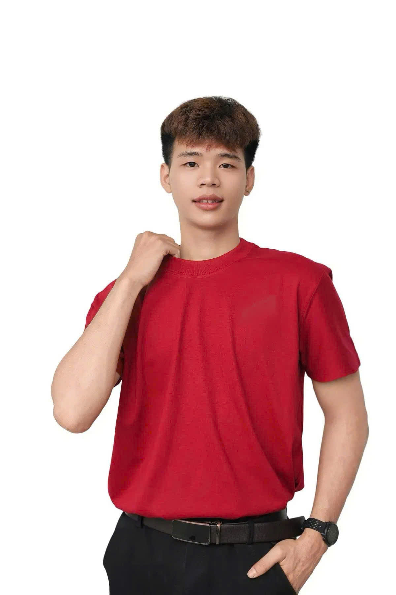

# FULL SOURCE — Portfolio Tô Quốc Hùng

## index.html
```html
<!DOCTYPE html>
<html lang="vi">
<head>
  <meta charset="UTF-8" />
  <meta name="viewport" content="width=device-width, initial-scale=1.0" />
  <title>Portfolio | Tô Quốc Hùng</title>
  <meta name="description" content="Tô Quốc Hùng — Sinh viên Logistics & Supply Chain | Basketball Coach | Đam mê công nghệ" />

  <!-- Fonts -->
  <link rel="preconnect" href="https://fonts.googleapis.com" />
  <link rel="preconnect" href="https://fonts.gstatic.com" crossorigin />
  <link href="https://fonts.googleapis.com/css2?family=Space+Grotesk:wght@300;400;500;600;700&family=Fira+Code:wght@400;500&display=swap" rel="stylesheet" />

  <!-- Icons -->
  <link rel="stylesheet" href="https://cdnjs.cloudflare.com/ajax/libs/font-awesome/6.5.0/css/all.min.css" />

  <!-- GSAP -->
  <script src="https://cdnjs.cloudflare.com/ajax/libs/gsap/3.12.4/gsap.min.js"></script>
  <script src="https://cdnjs.cloudflare.com/ajax/libs/gsap/3.12.4/ScrollTrigger.min.js"></script>

  <!-- Spline 3D viewer -->
  <script type="module" src="https://unpkg.com/@splinetool/viewer@1.0.0/build/spline-viewer.js"></script>

  <link rel="stylesheet" href="assets/css/style.css" />
</head>
<body>

  <!-- ========== CURSOR ========== -->
  <div class="cursor" id="cursor"></div>
  <div class="cursor-follower" id="cursorFollower"></div>

  <!-- ========== NAV ========== -->
  <nav class="navbar" id="navbar">
    <div class="nav-logo">
      <span class="logo-bracket">&lt;</span>TÔ QUỐC HÙNG<span class="logo-bracket">/&gt;</span>
    </div>
    <ul class="nav-links" id="navLinks">
      <li><a href="#hero"      class="nav-link" data-i18n="nav_home">Home</a></li>
      <li><a href="#about"     class="nav-link" data-i18n="nav_about">About</a></li>
      <li><a href="#skills"    class="nav-link" data-i18n="nav_skills">Skills</a></li>
      <li><a href="#workstyle" class="nav-link" data-i18n="nav_workstyle">Work Style</a></li>
      <li><a href="#projects"  class="nav-link" data-i18n="nav_projects">Activities</a></li>
      <li><a href="#contact"   class="nav-link" data-i18n="nav_contact">Contact</a></li>
    </ul>

    <!-- Language toggle -->
    <button class="lang-toggle" id="langToggle" title="Switch language">
      <span class="lang-vi active">VI</span>
      <span class="lang-divider">|</span>
      <span class="lang-en">EN</span>
    </button>

    <button class="hamburger" id="hamburger" aria-label="Menu">
      <span></span><span></span><span></span>
    </button>
  </nav>

  <!-- ========== HERO ========== -->
  <section class="hero" id="hero">
    <!-- Spline 3D Background -->
    <div class="spline-container" id="splineContainer">
      <spline-viewer
        url="https://prod.spline.design/6Wq1Q7YGyM-iab9i/scene.splinecode"
        loading-anim-type="none"
      ></spline-viewer>
    </div>

    <!-- Particle canvas -->
    <canvas id="particleCanvas"></canvas>

    <!-- Hero content -->
    <div class="hero-content" id="heroContent">
      <div class="hero-tag" data-gsap="fadeUp">
        <span class="dot"></span>
        <span data-i18n="hero_tag">Sẵn sàng cho cơ hội mới</span>
      </div>
      <h1 class="hero-title" data-gsap="fadeUp">
        <span class="line" data-i18n="hero_greeting">Xin chào, tôi là</span>
        <span class="line name-gradient">Tô Quốc Hùng</span>
      </h1>
      <p class="hero-subtitle" data-gsap="fadeUp">
        <span id="typedText"></span><span class="cursor-blink">|</span>
      </p>
      <div class="hero-cta" data-gsap="fadeUp">
        <a href="#projects" class="btn btn-primary">
          <span data-i18n="hero_btn1">Xem hoạt động</span>
          <i class="fa-solid fa-arrow-right"></i>
        </a>
        <a href="#contact" class="btn btn-outline">
          <span data-i18n="hero_btn2">Liên hệ</span>
        </a>
      </div>
    </div>

    <!-- Video giữa trang -->
    <div class="hero-video-wrapper" id="heroVideo">
      <div class="hero-video-frame">
        <video src="assets/grok.mp4" autoplay muted loop playsinline class="hero-video"></video>
        <div class="hero-video-glow"></div>
      </div>
    </div>

    <!-- Scroll indicator -->
    <div class="scroll-indicator">
      <div class="scroll-line"></div>
      <span>Scroll</span>
    </div>
  </section>

  <!-- ========== ABOUT ========== -->
  <section class="about section" id="about">
    <div class="container">
      <div class="section-header">
        <span class="section-tag" data-i18n="about_tag">01 — About</span>
        <h2 class="section-title">
          <span data-i18n="about_title">Về</span>
          <span class="highlight" data-i18n="about_highlight">tôi</span>
        </h2>
      </div>

      <div class="about-grid">
        <!-- Avatar 3D card -->
        <div class="about-visual" id="aboutCard">
          <div class="card-3d" id="card3d">
            <div class="card-inner">
              <div class="avatar-placeholder">
                
                <div class="avatar-glow"></div>
              </div>
              <div class="card-badge card-badge-1">
                <i class="fa-solid fa-basketball"></i> Coach
              </div>
              <div class="card-badge card-badge-2">
                <i class="fa-solid fa-robot"></i> AI Tools
              </div>
              <div class="card-badge card-badge-3">
                <i class="fa-solid fa-truck-fast"></i> Logistics
              </div>
            </div>
          </div>
        </div>

        <!-- About text -->
        <div class="about-text">
          <div class="about-name-row">
            <h3 class="about-name">Tô Quốc Hùng</h3>
            <span class="about-dob">
              <i class="fa-solid fa-cake-candles"></i>
              <span data-i18n="about_dob">Sinh năm 2005</span>
            </span>
          </div>
          <p class="about-intro" data-i18n-html="about_intro">
            Tôi là sinh viên năm 3 ngành <strong>Logistics &amp; Supply Chain</strong> — một người
            luôn chủ động học hỏi, nhiệt tình trong mọi việc và sẵn sàng thích nghi với môi
            trường mới nhanh chóng.
          </p>
          <p class="about-body" data-i18n-html="about_body">
            Ngoài học thuật, tôi còn là một <strong>Basketball Coach</strong> — nơi tôi rèn luyện
            tư duy lãnh đạo, tinh thần đồng đội và khả năng ra quyết định dưới áp lực.
            Tôi đam mê công nghệ và ứng dụng các công cụ AI hiện đại vào công việc thực tiễn.
          </p>

          <div class="about-strengths">
            <div class="strength-item">
              <i class="fa-solid fa-fire"></i>
              <span data-i18n="strength_1">Ham học hỏi</span>
            </div>
            <div class="strength-item">
              <i class="fa-solid fa-heart"></i>
              <span data-i18n="strength_2">Nhiệt tình</span>
            </div>
            <div class="strength-item">
              <i class="fa-solid fa-bolt"></i>
              <span data-i18n="strength_3">Nhanh nhẹn</span>
            </div>
          </div>

          <div class="about-stats">
            <div class="stat-item">
              <span class="stat-number" data-target="3">0</span>
              <span class="stat-label" data-i18n="stat_1_label">Năm học</span>
            </div>
            <div class="stat-item">
              <span class="stat-number" data-target="2005">0</span>
              <span class="stat-label" data-i18n="stat_2_label">Năm sinh</span>
            </div>
            <div class="stat-item">
              <span class="stat-number" data-target="100">0</span>
              <span class="stat-label" data-i18n="stat_3_label">% Nhiệt huyết</span>
            </div>
          </div>

          <div class="about-links">
            <a href="mailto:tohungg2005@gmail.com" class="social-link" title="Email">
              <i class="fa-solid fa-envelope"></i>
            </a>
            <a href="https://fb.com/hung.to05" target="_blank" class="social-link" title="Facebook">
              <i class="fa-brands fa-facebook"></i>
            </a>
            <a href="tel:0941428859" class="social-link" title="0941 428 859">
              <i class="fa-solid fa-phone"></i>
            </a>
          </div>
        </div>
      </div>
    </div>
  </section>

  <!-- ========== SKILLS ========== -->
  <section class="skills section" id="skills">
    <div class="container">
      <div class="section-header">
        <span class="section-tag" data-i18n="skills_tag">02 — Skills</span>
        <h2 class="section-title">
          <span data-i18n="skills_title">Kỹ</span>
          <span class="highlight" data-i18n="skills_highlight">năng</span>
        </h2>
      </div>

      <div class="skills-grid">

        <div class="skill-card" data-delay="0">
          <div class="skill-card-icon"><i class="fa-solid fa-robot"></i></div>
          <h3 class="skill-card-title" data-i18n="skill1_title">AI & Công cụ số</h3>
          <p class="skill-card-desc" data-i18n="skill1_desc">Sử dụng thành thạo các công cụ AI hiện đại và phần mềm thiết kế để tối ưu công việc</p>
          <div class="skill-tags">
            <span class="tag">ChatGPT</span>
            <span class="tag">Gemini</span>
            <span class="tag">Copilot</span>
            <span class="tag">Canva</span>
          </div>
        </div>

        <div class="skill-card" data-delay="100">
          <div class="skill-card-icon"><i class="fa-solid fa-table-cells"></i></div>
          <h3 class="skill-card-title" data-i18n="skill2_title">Office & Văn phòng</h3>
          <p class="skill-card-desc" data-i18n="skill2_desc">Thành thạo bộ công cụ văn phòng Microsoft — soạn thảo, lập bảng tính và thiết kế thuyết trình chuyên nghiệp</p>
          <div class="skill-tags">
            <span class="tag">Word</span>
            <span class="tag">Excel</span>
            <span class="tag">PowerPoint</span>
          </div>
        </div>

        <div class="skill-card" data-delay="200">
          <div class="skill-card-icon"><i class="fa-solid fa-people-group"></i></div>
          <h3 class="skill-card-title" data-i18n="skill3_title">Kỹ năng mềm</h3>
          <p class="skill-card-desc" data-i18n="skill3_desc">Tư duy phân tích, lập kế hoạch bài bản — kết hợp khả năng giải quyết vấn đề linh hoạt và giao tiếp, đàm phán hiệu quả trong mọi tình huống</p>
          <div class="skill-tags">
            <span class="tag" data-i18n="stag3_1">Phân tích & Lập kế hoạch</span>
            <span class="tag" data-i18n="stag3_2">Giải quyết vấn đề</span>
            <span class="tag" data-i18n="stag3_3">Giao tiếp & Đàm phán</span>
            <span class="tag" data-i18n="stag3_4">Tư duy linh hoạt</span>
          </div>
        </div>

      </div>

      <div class="tech-orbit-wrapper">
        <div class="tech-orbit-title" data-i18n="orbit_title">Công cụ thường dùng</div>
        <div class="tech-orbit" id="techOrbit">
          <div class="orbit-center"><i class="fa-solid fa-toolbox"></i></div>
          <div class="orbit orbit-1">
            <div class="orbit-item" style="--angle:0deg"><span>Word</span></div>
            <div class="orbit-item" style="--angle:72deg"><span>Excel</span></div>
            <div class="orbit-item" style="--angle:144deg"><span>PPT</span></div>
            <div class="orbit-item" style="--angle:216deg"><span>Canva</span></div>
            <div class="orbit-item" style="--angle:288deg"><span>AI</span></div>
          </div>
          <div class="orbit orbit-2">
            <div class="orbit-item" style="--angle:36deg"><span>ChatGPT</span></div>
            <div class="orbit-item" style="--angle:108deg"><span>Gemini</span></div>
            <div class="orbit-item" style="--angle:180deg"><span>Copilot</span></div>
            <div class="orbit-item" style="--angle:252deg"><span>Google</span></div>
            <div class="orbit-item" style="--angle:324deg"><span>Drive</span></div>
          </div>
        </div>
      </div>

    </div>
  </section>

  <!-- ========== WORK STYLE ========== -->
  <section class="workstyle section" id="workstyle">
    <div class="container">
      <div class="section-header">
        <span class="section-tag" data-i18n="ws_tag">03 — Work Style</span>
        <h2 class="section-title">
          <span data-i18n="ws_title">Phong cách</span>
          <span class="highlight" data-i18n="ws_highlight">làm việc</span>
        </h2>
      </div>

      <div class="workstyle-grid">
        <div class="ws-card" data-delay="0">
          <div class="ws-icon"><i class="fa-solid fa-gauge-high"></i></div>
          <h4 class="ws-title" data-i18n="ws1_title">Nhanh — Đúng hẹn — Kết quả tốt</h4>
          <p class="ws-desc" data-i18n="ws1_desc">Phong cách làm việc của tôi tập trung vào tốc độ và chất lượng. Deadline là cam kết, không phải lời nhắc nhở.</p>
        </div>
        <div class="ws-card" data-delay="100">
          <div class="ws-icon"><i class="fa-solid fa-people-carry-box"></i></div>
          <h4 class="ws-title" data-i18n="ws2_title">Teamwork là ưu tiên số 1</h4>
          <p class="ws-desc" data-i18n="ws2_desc">Tôi thích làm việc nhóm hơn là độc lập — hoà đồng, luôn tiếp thu ý kiến và sẵn sàng dẫn dắt khi cần.</p>
        </div>
        <div class="ws-card" data-delay="200">
          <div class="ws-icon"><i class="fa-solid fa-lightbulb"></i></div>
          <h4 class="ws-title" data-i18n="ws3_title">Giải quyết vấn đề nhanh chóng</h4>
          <p class="ws-desc" data-i18n="ws3_desc">Khi gặp sự cố, tôi không đứng yên. Tôi luôn tìm ra hướng giải quyết nhanh nhất và hiệu quả nhất.</p>
        </div>
        <div class="ws-card" data-delay="300">
          <div class="ws-icon"><i class="fa-solid fa-arrows-spin"></i></div>
          <h4 class="ws-title" data-i18n="ws4_title">Thích nghi cực nhanh</h4>
          <p class="ws-desc" data-i18n="ws4_desc">Môi trường mới không làm tôi lo lắng — tôi xem đó là cơ hội để học và phát triển thêm.</p>
        </div>
        <div class="ws-card" data-delay="400">
          <div class="ws-icon"><i class="fa-solid fa-shield-halved"></i></div>
          <h4 class="ws-title" data-i18n="ws5_title">Tinh thần trách nhiệm cao</h4>
          <p class="ws-desc" data-i18n="ws5_desc">Công việc được giao là trách nhiệm tôi đặt lên hàng đầu — không đổ lỗi, không thoái thác.</p>
        </div>
        <div class="ws-card" data-delay="500">
          <div class="ws-icon"><i class="fa-solid fa-clock-rotate-left"></i></div>
          <h4 class="ws-title" data-i18n="ws6_title">Quản lý thời gian linh hoạt</h4>
          <p class="ws-desc" data-i18n="ws6_desc">Xử lý deadline nhanh chóng nhờ kỹ năng lên kế hoạch và phân bổ thời gian hợp lý theo từng ưu tiên.</p>
        </div>
      </div>

      <div class="ws-quote">
        <div class="ws-quote-icon"><i class="fa-solid fa-quote-left"></i></div>
        <p data-i18n="ws_quote">"Tôi không chỉ hoàn thành công việc — tôi làm cho nó tốt hơn mong đợi."</p>
        <span>— Tô Quốc Hùng</span>
      </div>

    </div>
  </section>

  <!-- ========== ACTIVITIES & ACHIEVEMENTS ========== -->
  <section class="activities section" id="projects">
    <div class="container">
      <div class="section-header">
        <span class="section-tag" data-i18n="act_tag">04 — Activities</span>
        <h2 class="section-title">
          <span data-i18n="act_title">Hoạt động &amp;</span>
          <span class="highlight" data-i18n="act_highlight">Thành tích</span>
        </h2>
      </div>

      <div class="projects-grid">

        <div class="project-card" data-tilt>
          <div class="project-card-bg"></div>
          <div class="project-content">
            <div class="project-number">01</div>
            <div class="project-icon"><i class="fa-solid fa-basketball"></i></div>
            <h3 class="project-title" data-i18n="act1_title">Huấn luyện viên Bóng rổ</h3>
            <p class="project-desc" data-i18n="act1_desc">Thiết kế chương trình huấn luyện toàn diện giúp trẻ phát triển thể chất — tăng chiều cao, cơ bắp và sự nhanh nhẹn. Dẫn dắt đội thi đấu đạt nhiều thành tích ấn tượng, xây dựng tinh thần đội nhóm và kỷ luật thi đấu chuyên nghiệp. Giao tiếp tốt bằng tiếng Anh trong môi trường huấn luyện quốc tế.</p>
            <div class="project-tags">
              <span data-i18n="act1_date">2023 — 2026</span>
              <span data-i18n="tag_coaching">Coaching</span>
              <span data-i18n="tag_leadership">Lãnh đạo</span>
              <span>English</span>
            </div>
          </div>
        </div>

        <div class="project-card" data-tilt>
          <div class="project-card-bg"></div>
          <div class="project-content">
            <div class="project-number">02</div>
            <div class="project-icon"><i class="fa-solid fa-landmark"></i></div>
            <h3 class="project-title" data-i18n="act2_title">Uỷ viên BCH — Khoa QTKD · HUFLIT</h3>
            <p class="project-desc" data-i18n="act2_desc">Đảm nhận vai trò Uỷ viên Ban Chấp hành Khoa Quản trị Kinh doanh — HUFLIT. Tham gia hoạch định, tổ chức và điều phối các hoạt động khoa — cầu nối giữa sinh viên và ban lãnh đạo, thúc đẩy tinh thần học thuật và cộng đồng khoa.</p>
            <div class="project-tags">
              <span data-i18n="act2_date">2023 — 2024</span>
              <span>HUFLIT</span>
              <span data-i18n="tag_org">Tổ chức</span>
              <span>QTKD</span>
            </div>
          </div>
        </div>

        <div class="project-card" data-tilt>
          <div class="project-card-bg"></div>
          <div class="project-content">
            <div class="project-number">03</div>
            <div class="project-icon"><i class="fa-solid fa-gamepad"></i></div>
            <h3 class="project-title" data-i18n="act3_title">Phó Chủ nhiệm · ESC HUFLIT</h3>
            <p class="project-desc" data-i18n="act3_desc">Phụ trách training đội tuyển, xây dựng giáo án và lộ trình phát triển chuyên môn cho thành viên. Lên kế hoạch & điều hành toàn bộ quy trình tổ chức các giải đấu nội bộ và liên trường (5v5, Road to VCS,...). CLB đạt cú đúp danh hiệu tại các giải Esports sinh viên quy mô lớn.</p>
            <div class="project-tags">
              <span data-i18n="act3_date">2025 — 2026</span>
              <span>Esports</span>
              <span data-i18n="tag_event">Tổ chức giải</span>
              <span>ESC HUFLIT</span>
            </div>
          </div>
        </div>

      </div>


    </div>
  </section>

  <!-- ========== CONTACT ========== -->
  <section class="contact section" id="contact">
    <div class="container">
      <div class="section-header">
        <span class="section-tag" data-i18n="contact_tag">05 — Contact</span>
        <h2 class="section-title">
          <span data-i18n="contact_title">Liên</span>
          <span class="highlight" data-i18n="contact_highlight">hệ</span>
        </h2>
      </div>

      <div class="contact-wrapper">
        <div class="contact-info">
          <p class="contact-intro" data-i18n-html="contact_intro">
            Một người trẻ với nền tảng Logistics, kinh nghiệm dẫn dắt đội nhóm trong thể thao và Esports,<br>luôn đặt kế hoạch lên trước — hành động đúng lúc — và không ngừng học hỏi để phát triển.<br>Nếu bạn cần một người đồng hành nghiêm túc, hãy để lại lời nhắn.
          </p>
          <p class="contact-sign" data-i18n="contact_sign">— Tô Quốc Hùng</p>
          <div class="contact-items">
            <a href="mailto:tohungg2005@gmail.com" class="contact-item">
              <div class="contact-item-icon"><i class="fa-solid fa-envelope"></i></div>
              <div>
                <span class="contact-item-label" data-i18n="contact_label_email">Email</span>
                <span class="contact-item-value">tohungg2005@gmail.com</span>
              </div>
            </a>
            <a href="https://fb.com/hung.to05" target="_blank" class="contact-item">
              <div class="contact-item-icon"><i class="fa-brands fa-facebook"></i></div>
              <div>
                <span class="contact-item-label" data-i18n="contact_label_fb">Facebook</span>
                <span class="contact-item-value">fb.com/hung.to05</span>
              </div>
            </a>
            <a href="tel:0941428859" class="contact-item">
              <div class="contact-item-icon"><i class="fa-solid fa-phone"></i></div>
              <div>
                <span class="contact-item-label" data-i18n="contact_label_phone">Điện thoại</span>
                <span class="contact-item-value">0941 428 859</span>
              </div>
            </a>
          </div>
        </div>

        <form class="contact-form" id="contactForm">
          <div class="form-group">
            <label for="name" data-i18n="form_name">Tên của bạn</label>
            <input type="text" id="name" name="name" data-i18n-placeholder="form_placeholder_name" placeholder="Nguyễn Văn A" required />
          </div>
          <div class="form-group">
            <label for="email" data-i18n="form_email">Email</label>
            <input type="email" id="email" name="email" placeholder="email@example.com" required />
          </div>
          <div class="form-group">
            <label for="subject" data-i18n="form_subject">Chủ đề</label>
            <select id="subject" name="subject">
              <option value=""          data-i18n="form_opt0">Chọn chủ đề...</option>
              <option value="coaching"  data-i18n="form_opt1">Basketball Coaching</option>
              <option value="esports"   data-i18n="form_opt2">Esports & CLB</option>
              <option value="collab"    data-i18n="form_opt3">Hợp tác & Kết nối</option>
              <option value="other"     data-i18n="form_opt4">Khác</option>
            </select>
          </div>
          <div class="form-group">
            <label for="message" data-i18n="form_message">Lời nhắn</label>
            <textarea id="message" name="message" rows="5" data-i18n-placeholder="form_placeholder_message" placeholder="Nội dung bạn muốn chia sẻ..."></textarea>
          </div>
          <button type="submit" class="btn btn-primary btn-full">
            <span data-i18n="form_btn">Gửi lời nhắn</span>
            <i class="fa-solid fa-paper-plane"></i>
          </button>
        </form>
      </div>
    </div>
  </section>

  <!-- ========== FOOTER ========== -->
  <footer class="footer">
    <div class="container">
      <div class="footer-content">
        <div class="footer-logo">
          <span class="logo-bracket">&lt;</span>TÔ QUỐC HÙNG<span class="logo-bracket">/&gt;</span>
        </div>
        <p class="footer-text">
          <span data-i18n="footer_text">Built with</span>
          <span class="heart">♥</span> and lots of <span class="code-tag">&lt;code/&gt;</span>
        </p>
        <div class="footer-socials">
          <a href="mailto:tohungg2005@gmail.com" title="Email"><i class="fa-solid fa-envelope"></i></a>
          <a href="https://fb.com/hung.to05" target="_blank" title="Facebook"><i class="fa-brands fa-facebook"></i></a>
          <a href="tel:0941428859" title="Điện thoại"><i class="fa-solid fa-phone"></i></a>
        </div>
      </div>
    </div>
  </footer>

  <script src="assets/js/translations.js"></script>
  <script src="assets/js/main.js"></script>
</body>
</html>

```

## assets/css/style.css
```css
/* ============================================================
   PORTFOLIO — Dark & Modern Theme
   ============================================================ */

/* ---------- CSS Variables ---------- */
:root {
  --bg-primary:    #080b14;
  --bg-secondary:  #0d1117;
  --bg-card:       rgba(255,255,255,0.04);
  --bg-card-hover: rgba(255,255,255,0.07);

  --accent:        #6c63ff;
  --accent-2:      #00d4ff;
  --accent-3:      #ff6584;
  --gradient:      linear-gradient(135deg, #6c63ff, #00d4ff);

  --text-primary:  #f0f0f0;
  --text-secondary:#9ca3af;
  --text-muted:    #4b5563;

  --border:        rgba(255,255,255,0.08);
  --border-hover:  rgba(108,99,255,0.4);

  --glass:         rgba(255,255,255,0.05);
  --glass-blur:    blur(20px);

  --font-main:     'Space Grotesk', sans-serif;
  --font-code:     'Fira Code', monospace;

  --radius:        16px;
  --radius-sm:     8px;
  --transition:    0.3s cubic-bezier(0.4, 0, 0.2, 1);
  --shadow:        0 25px 50px rgba(0,0,0,0.5);
}

/* ---------- Reset ---------- */
*, *::before, *::after { margin: 0; padding: 0; box-sizing: border-box; }

html {
  scroll-behavior: smooth;
  overflow-x: hidden;
}

body {
  font-family: var(--font-main);
  background: var(--bg-primary);
  color: var(--text-primary);
  overflow-x: hidden;
  cursor: none;
  line-height: 1.6;
}

a { color: inherit; text-decoration: none; }
ul { list-style: none; }
img { max-width: 100%; }

.container {
  max-width: 1200px;
  margin: 0 auto;
  padding: 0 2rem;
}

/* ============================================================
   CUSTOM CURSOR
   ============================================================ */
.cursor {
  width: 10px;
  height: 10px;
  background: var(--accent);
  border-radius: 50%;
  position: fixed;
  top: 0; left: 0;
  pointer-events: none;
  z-index: 9999;
  transform: translate(-50%, -50%);
  transition: transform 0.1s ease, background 0.3s ease;
  mix-blend-mode: difference;
}

.cursor-follower {
  width: 36px;
  height: 36px;
  border: 1.5px solid var(--accent);
  border-radius: 50%;
  position: fixed;
  top: 0; left: 0;
  pointer-events: none;
  z-index: 9998;
  transform: translate(-50%, -50%);
  transition: transform 0.15s ease, width 0.3s ease, height 0.3s ease, border-color 0.3s ease;
  opacity: 0.5;
}

.cursor.expanded { transform: translate(-50%, -50%) scale(2.5); }
.cursor-follower.expanded { width: 56px; height: 56px; opacity: 0.3; }

/* ============================================================
   NAVBAR
   ============================================================ */
.navbar {
  position: fixed;
  top: 0; left: 0; right: 0;
  z-index: 1000;
  padding: 1.2rem 3rem;
  display: flex;
  align-items: center;
  justify-content: space-between;
  transition: background var(--transition), padding var(--transition);
}

.navbar.scrolled {
  background: rgba(8, 11, 20, 0.9);
  backdrop-filter: var(--glass-blur);
  border-bottom: 1px solid var(--border);
  padding: 0.8rem 3rem;
}

.nav-logo {
  font-family: var(--font-code);
  font-size: 1.2rem;
  font-weight: 500;
  color: var(--text-primary);
}

.logo-bracket { color: var(--accent); }

.nav-links {
  display: flex;
  gap: 2.5rem;
}

.nav-link {
  font-size: 0.9rem;
  font-weight: 500;
  color: var(--text-secondary);
  position: relative;
  transition: color var(--transition);
}

.nav-link::after {
  content: '';
  position: absolute;
  bottom: -4px; left: 0;
  width: 0;
  height: 2px;
  background: var(--gradient);
  border-radius: 2px;
  transition: width var(--transition);
}

.nav-link:hover,
.nav-link.active { color: var(--text-primary); }
.nav-link:hover::after,
.nav-link.active::after { width: 100%; }

/* Language Toggle */
.lang-toggle {
  display: flex;
  align-items: center;
  gap: 0.3rem;
  background: rgba(255,255,255,0.05);
  border: 1px solid var(--border);
  border-radius: 100px;
  padding: 0.35rem 0.85rem;
  cursor: none;
  transition: var(--transition);
  font-family: var(--font-code);
  font-size: 0.78rem;
  font-weight: 600;
  letter-spacing: 0.05em;
  color: var(--text-muted);
}

.lang-toggle:hover {
  border-color: var(--accent);
  background: rgba(108,99,255,0.1);
}

.lang-vi, .lang-en {
  transition: color var(--transition);
  color: var(--text-muted);
}

.lang-vi.active, .lang-en.active {
  color: var(--accent);
}

.lang-divider {
  color: var(--border);
  font-size: 0.7rem;
}

.hamburger {
  display: none;
  flex-direction: column;
  gap: 5px;
  background: none;
  border: none;
  cursor: none;
  padding: 4px;
}

.hamburger span {
  display: block;
  width: 24px;
  height: 2px;
  background: var(--text-primary);
  border-radius: 2px;
  transition: var(--transition);
}

/* ============================================================
   HERO
   ============================================================ */
.hero {
  position: relative;
  min-height: 100vh;
  display: flex;
  align-items: flex-end;
  overflow: hidden;
  padding-bottom: 6rem;
}

/* Spline background */
.spline-container {
  position: absolute;
  inset: 0;
  z-index: 0;
  opacity: 0.7;
}

.spline-container spline-viewer {
  width: 100%;
  height: 100%;
}

/* Particle canvas */
#particleCanvas {
  position: absolute;
  inset: 0;
  z-index: 1;
  pointer-events: none;
}

/* Gradient overlay */
.hero::before {
  content: '';
  position: absolute;
  inset: 0;
  background:
    radial-gradient(ellipse 60% 60% at 50% 50%, rgba(108,99,255,0.10), transparent),
    linear-gradient(to bottom, rgba(8,11,20,0.6) 0%, rgba(8,11,20,0.5) 100%);
  z-index: 2;
}

.hero-content {
  position: relative;
  z-index: 4;
  padding: 0 3rem;
  max-width: 520px;
}

.hero-tag {
  display: inline-flex;
  align-items: center;
  gap: 0.5rem;
  background: rgba(108,99,255,0.15);
  border: 1px solid rgba(108,99,255,0.3);
  border-radius: 100px;
  padding: 0.4rem 1rem;
  font-size: 0.8rem;
  font-weight: 500;
  color: var(--accent);
  margin-bottom: 1.5rem;
  opacity: 0;
}

.dot {
  width: 8px; height: 8px;
  background: var(--accent);
  border-radius: 50%;
  animation: pulse-dot 2s infinite;
}

@keyframes pulse-dot {
  0%, 100% { box-shadow: 0 0 0 0 rgba(108,99,255,0.6); }
  50% { box-shadow: 0 0 0 6px rgba(108,99,255,0); }
}

.hero-title {
  font-size: clamp(3rem, 7vw, 6rem);
  font-weight: 700;
  line-height: 1.1;
  margin-bottom: 1.5rem;
}

.hero-title .line { display: block; opacity: 0; transform: translateY(30px); }

.name-gradient {
  background: var(--gradient);
  -webkit-background-clip: text;
  -webkit-text-fill-color: transparent;
  background-clip: text;
}

.hero-subtitle {
  font-size: 1.2rem;
  color: var(--text-secondary);
  margin-bottom: 2.5rem;
  font-family: var(--font-code);
  min-height: 2rem;
  opacity: 0;
}

.cursor-blink {
  animation: blink 1s step-end infinite;
  color: var(--accent);
}

@keyframes blink {
  0%, 100% { opacity: 1; }
  50% { opacity: 0; }
}

.hero-cta {
  display: flex;
  gap: 1rem;
  flex-wrap: wrap;
  opacity: 0;
}

/* ---- Hero Video (chính giữa màn hình) ---- */
.hero-video-wrapper {
  position: absolute;
  top: 50%;
  left: 50%;
  transform: translate(-50%, -50%);
  z-index: 3;
  opacity: 0;
  animation: video-fade-in 1s ease 1.6s forwards;
  pointer-events: none;
}

@keyframes video-fade-in {
  from { opacity: 0; transform: translate(-50%, -46%) scale(0.94); }
  to   { opacity: 1; transform: translate(-50%, -50%) scale(1); }
}

.hero-video-frame {
  position: relative;
  border-radius: 22px;
  overflow: hidden;
  border: 1.5px solid rgba(108,99,255,0.5);
  box-shadow:
    0 0 0 1px rgba(0,212,255,0.12),
    0 40px 100px rgba(0,0,0,0.75),
    0 0 80px rgba(108,99,255,0.3),
    0 0 160px rgba(108,99,255,0.12);
}

.hero-video {
  display: block;
  width: min(560px, 80vw);
  height: auto;
  border-radius: 20px;
}

.hero-video-glow {
  position: absolute;
  inset: 0;
  border-radius: 20px;
  background: radial-gradient(ellipse at 50% 0%, rgba(108,99,255,0.18), transparent 65%);
  pointer-events: none;
}

/* Scroll indicator */
.scroll-indicator {
  position: absolute;
  bottom: 2.5rem;
  left: 50%;
  transform: translateX(-50%);
  z-index: 3;
  display: flex;
  flex-direction: column;
  align-items: center;
  gap: 0.5rem;
  opacity: 0.5;
}

.scroll-line {
  width: 1px;
  height: 50px;
  background: linear-gradient(to bottom, var(--accent), transparent);
  animation: scroll-anim 2s ease infinite;
}

.scroll-indicator span {
  font-size: 0.7rem;
  letter-spacing: 0.2em;
  text-transform: uppercase;
  color: var(--text-muted);
  font-family: var(--font-code);
}

@keyframes scroll-anim {
  0% { transform: scaleY(0); transform-origin: top; }
  50% { transform: scaleY(1); transform-origin: top; }
  51% { transform: scaleY(1); transform-origin: bottom; }
  100% { transform: scaleY(0); transform-origin: bottom; }
}

/* ============================================================
   BUTTONS
   ============================================================ */
.btn {
  display: inline-flex;
  align-items: center;
  gap: 0.6rem;
  padding: 0.85rem 2rem;
  border-radius: var(--radius-sm);
  font-family: var(--font-main);
  font-size: 0.95rem;
  font-weight: 600;
  cursor: none;
  transition: var(--transition);
  position: relative;
  overflow: hidden;
  border: none;
}

.btn::before {
  content: '';
  position: absolute;
  inset: 0;
  background: rgba(255,255,255,0.1);
  transform: translateX(-100%);
  transition: transform 0.4s ease;
}

.btn:hover::before { transform: translateX(0); }

.btn-primary {
  background: var(--gradient);
  color: #fff;
  box-shadow: 0 8px 30px rgba(108,99,255,0.4);
}

.btn-primary:hover {
  transform: translateY(-2px);
  box-shadow: 0 12px 40px rgba(108,99,255,0.5);
}

.btn-outline {
  background: transparent;
  color: var(--text-primary);
  border: 1.5px solid var(--border);
}

.btn-outline:hover {
  border-color: var(--accent);
  color: var(--accent);
  transform: translateY(-2px);
}

.btn-full { width: 100%; justify-content: center; }

/* ============================================================
   SECTIONS (shared)
   ============================================================ */
.section {
  padding: 8rem 0;
  position: relative;
}

.section-header {
  margin-bottom: 4rem;
}

.section-tag {
  font-family: var(--font-code);
  font-size: 0.8rem;
  color: var(--accent);
  letter-spacing: 0.1em;
  text-transform: uppercase;
  display: block;
  margin-bottom: 0.8rem;
}

.section-title {
  font-size: clamp(2rem, 4vw, 3rem);
  font-weight: 700;
  line-height: 1.2;
}

.highlight {
  background: var(--gradient);
  -webkit-background-clip: text;
  -webkit-text-fill-color: transparent;
  background-clip: text;
}

/* ============================================================
   ABOUT
   ============================================================ */
.about { background: var(--bg-secondary); }

.about-grid {
  display: grid;
  grid-template-columns: 1fr 1.5fr;
  gap: 5rem;
  align-items: center;
}

/* 3D card */
.about-visual {
  display: flex;
  justify-content: center;
}

.card-3d {
  width: 320px;
  height: 400px;
  perspective: 1000px;
  cursor: none;
}

.card-inner {
  position: relative;
  width: 100%;
  height: 100%;
  background: var(--bg-card);
  border: 1px solid var(--border);
  border-radius: var(--radius);
  transition: transform 0.1s ease;
  transform-style: preserve-3d;
  overflow: hidden;
}

.card-inner::before {
  content: '';
  position: absolute;
  inset: -1px;
  border-radius: var(--radius);
  background: var(--gradient);
  z-index: -1;
  opacity: 0;
  transition: opacity var(--transition);
}

.card-3d:hover .card-inner::before { opacity: 0.5; }

.avatar-placeholder {
  position: relative;
  width: 100%;
  height: 100%;
}

.avatar-img {
  width: 100%;
  height: 100%;
  border-radius: var(--radius);
  object-fit: cover;
  object-position: top;
  display: block;
}

.avatar-icon {
  width: 120px; height: 120px;
  border-radius: 50%;
  background: var(--gradient);
  display: flex;
  align-items: center;
  justify-content: center;
  font-size: 3rem;
  color: white;
}

.avatar-glow {
  display: none;
}

.card-badge {
  position: absolute;
  backdrop-filter: blur(16px);
  border-radius: 14px;
  padding: 0.6rem 1.1rem;
  font-size: 0.82rem;
  font-weight: 700;
  display: flex;
  align-items: center;
  gap: 0.55rem;
  white-space: nowrap;
  letter-spacing: 0.02em;
  animation: float-badge 3s ease-in-out infinite;
  z-index: 10;
}

/* Badge 1 — Coach — cam đỏ */
.card-badge-1 {
  top: -5%;
  right: -28%;
  background: rgba(255, 80, 60, 0.18);
  border: 1.5px solid rgba(255, 80, 60, 0.55);
  color: #ff9080;
  box-shadow: 0 4px 20px rgba(255, 80, 60, 0.35), inset 0 0 12px rgba(255,80,60,0.08);
  animation-delay: 0s;
}
.card-badge-1 i {
  color: #ff5c45;
  font-size: 1rem;
  filter: drop-shadow(0 0 6px rgba(255,80,60,0.8));
}

/* Badge 2 — AI Tools — xanh cyan */
.card-badge-2 {
  bottom: 22%;
  left: -32%;
  background: rgba(0, 212, 255, 0.15);
  border: 1.5px solid rgba(0, 212, 255, 0.5);
  color: #60eeff;
  box-shadow: 0 4px 20px rgba(0, 212, 255, 0.3), inset 0 0 12px rgba(0,212,255,0.08);
  animation-delay: 1s;
}
.card-badge-2 i {
  color: #00d4ff;
  font-size: 1rem;
  filter: drop-shadow(0 0 6px rgba(0,212,255,0.9));
}

/* Badge 3 — Logistics — tím accent */
.card-badge-3 {
  bottom: 2%;
  right: -30%;
  background: rgba(108, 99, 255, 0.18);
  border: 1.5px solid rgba(108, 99, 255, 0.55);
  color: #b0aaff;
  box-shadow: 0 4px 20px rgba(108, 99, 255, 0.35), inset 0 0 12px rgba(108,99,255,0.08);
  animation-delay: 2s;
}
.card-badge-3 i {
  color: #6c63ff;
  font-size: 1rem;
  filter: drop-shadow(0 0 6px rgba(108,99,255,0.9));
}

@keyframes float-badge {
  0%, 100% { transform: translateY(0) scale(1); }
  50%       { transform: translateY(-10px) scale(1.04); }
}

/* About text */
.about-intro {
  font-size: 1.1rem;
  color: var(--text-primary);
  margin-bottom: 1.2rem;
  line-height: 1.8;
}

.about-body {
  color: var(--text-secondary);
  margin-bottom: 2.5rem;
  line-height: 1.8;
}

.about-stats {
  display: flex;
  gap: 2.5rem;
  margin-bottom: 2rem;
}

.stat-item { text-align: center; }

.stat-number {
  display: block;
  font-size: 2.5rem;
  font-weight: 700;
  background: var(--gradient);
  -webkit-background-clip: text;
  -webkit-text-fill-color: transparent;
  background-clip: text;
  font-family: var(--font-code);
}

.stat-label {
  font-size: 0.8rem;
  color: var(--text-muted);
  text-transform: uppercase;
  letter-spacing: 0.08em;
}

.about-links {
  display: flex;
  gap: 1rem;
}

.social-link {
  width: 44px; height: 44px;
  border-radius: var(--radius-sm);
  border: 1px solid var(--border);
  display: flex;
  align-items: center;
  justify-content: center;
  color: var(--text-secondary);
  font-size: 1.1rem;
  transition: var(--transition);
  background: var(--bg-card);
}

.social-link:hover {
  border-color: var(--accent);
  color: var(--accent);
  background: rgba(108,99,255,0.1);
  transform: translateY(-3px);
}

/* ============================================================
   SKILLS
   ============================================================ */
.skills { background: var(--bg-primary); }

.skills-grid {
  display: grid;
  grid-template-columns: repeat(3, 1fr);
  gap: 1.5rem;
  margin-bottom: 5rem;
}
.skills-grid--center {
  max-width: 960px;
  margin-left: auto;
  margin-right: auto;
}

.skill-card {
  background: var(--bg-card);
  border: 1px solid var(--border);
  border-radius: var(--radius);
  padding: 2rem;
  transition: var(--transition);
  position: relative;
  overflow: hidden;
}

.skill-card::before {
  content: '';
  position: absolute;
  top: 0; left: 0; right: 0;
  height: 2px;
  background: var(--gradient);
  transform: scaleX(0);
  transition: transform var(--transition);
}

.skill-card:hover {
  background: var(--bg-card-hover);
  border-color: var(--border-hover);
  transform: translateY(-5px);
  box-shadow: var(--shadow);
}

.skill-card:hover::before { transform: scaleX(1); }

.skill-card-icon {
  width: 56px; height: 56px;
  border-radius: var(--radius-sm);
  background: rgba(108,99,255,0.15);
  display: flex;
  align-items: center;
  justify-content: center;
  font-size: 1.5rem;
  color: var(--accent);
  margin-bottom: 1.2rem;
  transition: var(--transition);
}

.skill-card:hover .skill-card-icon {
  background: var(--gradient);
  color: white;
}

.skill-card-title {
  font-size: 1.05rem;
  font-weight: 600;
  margin-bottom: 0.7rem;
}

.skill-card-desc {
  font-size: 0.88rem;
  color: var(--text-secondary);
  margin-bottom: 1.5rem;
  line-height: 1.6;
}

.skill-tags {
  display: flex;
  flex-wrap: wrap;
  gap: 0.5rem;
}

.tag {
  background: rgba(108,99,255,0.1);
  border: 1px solid rgba(108,99,255,0.2);
  border-radius: 100px;
  padding: 0.25rem 0.75rem;
  font-size: 0.75rem;
  font-weight: 500;
  color: var(--accent);
  font-family: var(--font-code);
}

/* Tech orbit */
.tech-orbit-wrapper {
  text-align: center;
}

.tech-orbit-title {
  font-size: 1.1rem;
  font-weight: 600;
  color: var(--text-secondary);
  margin-bottom: 2rem;
  font-family: var(--font-code);
}

.tech-orbit {
  position: relative;
  width: 360px;
  height: 360px;
  margin: 0 auto;
}

.orbit-center {
  position: absolute;
  top: 50%; left: 50%;
  transform: translate(-50%, -50%);
  width: 60px; height: 60px;
  border-radius: 50%;
  background: var(--gradient);
  display: flex;
  align-items: center;
  justify-content: center;
  font-size: 1.5rem;
  color: white;
  z-index: 2;
  box-shadow: 0 0 30px rgba(108,99,255,0.4);
}

.orbit {
  position: absolute;
  top: 50%; left: 50%;
  border-radius: 50%;
  border: 1px solid var(--border);
  animation: orbit-spin linear infinite;
}

.orbit-1 {
  width: 220px; height: 220px;
  margin: -110px 0 0 -110px;
  animation-duration: 12s;
}

.orbit-2 {
  width: 340px; height: 340px;
  margin: -170px 0 0 -170px;
  animation-duration: 20s;
  animation-direction: reverse;
}

@keyframes orbit-spin {
  from { transform: rotate(0deg); }
  to { transform: rotate(360deg); }
}

.orbit-item {
  position: absolute;
  top: 50%; left: 50%;
  width: 42px; height: 42px;
  margin: -21px 0 0 -21px;
  transform:
    rotate(var(--angle))
    translateX(calc(100% + 69px))
    rotate(calc(-1 * var(--angle)));
}

.orbit-2 .orbit-item {
  transform:
    rotate(var(--angle))
    translateX(calc(100% + 149px))
    rotate(calc(-1 * var(--angle)));
  animation: counter-spin 20s linear infinite;
}

@keyframes counter-spin {
  from { transform: rotate(var(--angle)) translateX(calc(100% + 149px)) rotate(calc(-1 * var(--angle))); }
  to   { transform: rotate(var(--angle)) translateX(calc(100% + 149px)) rotate(calc(-360deg - 1 * var(--angle))); }
}

.orbit-item span {
  display: flex;
  align-items: center;
  justify-content: center;
  width: 100%; height: 100%;
  border-radius: 50%;
  background: var(--bg-card);
  border: 1px solid var(--border);
  font-size: 0.65rem;
  font-family: var(--font-code);
  font-weight: 500;
  color: var(--text-secondary);
  transition: var(--transition);
}

.orbit-item:hover span {
  background: var(--accent);
  color: white;
  border-color: var(--accent);
  transform: scale(1.2);
}

.orbit-1 .orbit-item {
  animation: counter-spin-1 12s linear infinite;
}

@keyframes counter-spin-1 {
  from { transform: rotate(var(--angle)) translateX(calc(100% + 69px)) rotate(calc(-1 * var(--angle))); }
  to   { transform: rotate(var(--angle)) translateX(calc(100% + 69px)) rotate(calc(-360deg - 1 * var(--angle))); }
}

/* ============================================================
   PROJECTS
   ============================================================ */
.projects { background: var(--bg-secondary); }

.projects-grid {
  display: grid;
  grid-template-columns: repeat(3, 1fr);
  gap: 1.5rem;
}

.project-card {
  border-radius: var(--radius);
  border: 1px solid var(--border);
  overflow: hidden;
  position: relative;
  transition: var(--transition);
  cursor: none;
}

.project-card-bg {
  position: absolute;
  inset: 0;
  background: var(--bg-card);
  transition: var(--transition);
}

.project-card:hover .project-card-bg {
  background: var(--bg-card-hover);
}

.project-card:hover {
  border-color: var(--border-hover);
  transform: translateY(-8px);
  box-shadow: 0 30px 60px rgba(0,0,0,0.4);
}

.project-content {
  position: relative;
  padding: 2rem;
}

.project-number {
  font-family: var(--font-code);
  font-size: 0.75rem;
  color: var(--text-muted);
  margin-bottom: 1rem;
}

.project-icon {
  font-size: 1.8rem;
  color: var(--accent);
  margin-bottom: 1rem;
}

.project-title {
  font-size: 1.1rem;
  font-weight: 600;
  margin-bottom: 0.7rem;
}

.project-desc {
  font-size: 0.88rem;
  color: var(--text-secondary);
  line-height: 1.6;
  margin-bottom: 1.5rem;
}

.project-tags {
  display: flex;
  flex-wrap: wrap;
  gap: 0.5rem;
  margin-bottom: 1.5rem;
}

.project-tags span {
  background: rgba(0,212,255,0.1);
  border: 1px solid rgba(0,212,255,0.2);
  border-radius: 100px;
  padding: 0.2rem 0.7rem;
  font-size: 0.72rem;
  color: var(--accent-2);
  font-family: var(--font-code);
}

.project-links {
  display: flex;
  gap: 1rem;
}

.project-link {
  font-size: 0.82rem;
  color: var(--text-secondary);
  display: flex;
  align-items: center;
  gap: 0.4rem;
  transition: var(--transition);
}

.project-link:hover { color: var(--accent); }

/* ============================================================
   CONTACT
   ============================================================ */
.contact { background: var(--bg-primary); }

.contact-wrapper {
  display: grid;
  grid-template-columns: 1fr 1.5fr;
  gap: 5rem;
  align-items: start;
}

.contact-intro {
  color: var(--text-secondary);
  line-height: 2;
  margin-bottom: 1rem;
  font-size: 1rem;
  font-style: italic;
}

.contact-sign {
  font-family: var(--font-code);
  font-size: 0.9rem;
  color: var(--accent);
  margin-bottom: 2.5rem;
  letter-spacing: 0.03em;
}

.contact-items {
  display: flex;
  flex-direction: column;
  gap: 1rem;
}

.contact-item {
  display: flex;
  align-items: center;
  gap: 1rem;
  padding: 1rem 1.2rem;
  border-radius: var(--radius-sm);
  border: 1px solid var(--border);
  background: var(--bg-card);
  transition: var(--transition);
}

.contact-item:hover {
  border-color: var(--border-hover);
  background: var(--bg-card-hover);
  transform: translateX(5px);
}

.contact-item-icon {
  width: 42px; height: 42px;
  border-radius: var(--radius-sm);
  background: rgba(108,99,255,0.15);
  display: flex;
  align-items: center;
  justify-content: center;
  color: var(--accent);
  font-size: 1.1rem;
  flex-shrink: 0;
}

.contact-item-label {
  display: block;
  font-size: 0.75rem;
  color: var(--text-muted);
  text-transform: uppercase;
  letter-spacing: 0.08em;
  margin-bottom: 0.1rem;
}

.contact-item-value {
  display: block;
  font-size: 0.9rem;
  color: var(--text-primary);
  font-family: var(--font-code);
}

/* Contact form */
.contact-form {
  display: flex;
  flex-direction: column;
  gap: 1.2rem;
}

.form-group {
  display: flex;
  flex-direction: column;
  gap: 0.5rem;
}

.form-group label {
  font-size: 0.85rem;
  font-weight: 500;
  color: var(--text-secondary);
}

.form-group input,
.form-group select,
.form-group textarea {
  background: var(--bg-card);
  border: 1px solid var(--border);
  border-radius: var(--radius-sm);
  padding: 0.85rem 1.1rem;
  color: var(--text-primary);
  font-family: var(--font-main);
  font-size: 0.95rem;
  transition: var(--transition);
  outline: none;
  width: 100%;
}

.form-group select option {
  background: var(--bg-secondary);
}

.form-group input:focus,
.form-group select:focus,
.form-group textarea:focus {
  border-color: var(--accent);
  background: rgba(108,99,255,0.05);
  box-shadow: 0 0 0 3px rgba(108,99,255,0.1);
}

.form-group input::placeholder,
.form-group textarea::placeholder {
  color: var(--text-muted);
}

.form-group textarea { resize: vertical; min-height: 120px; }

/* ============================================================
   FOOTER
   ============================================================ */
.footer {
  background: var(--bg-secondary);
  border-top: 1px solid var(--border);
  padding: 2.5rem 0;
}

.footer-content {
  display: flex;
  align-items: center;
  justify-content: space-between;
  flex-wrap: wrap;
  gap: 1rem;
}

.footer-logo {
  font-family: var(--font-code);
  font-size: 1.1rem;
}

.footer-text {
  font-size: 0.85rem;
  color: var(--text-muted);
}

.heart { color: var(--accent-3); }
.code-tag { color: var(--accent); font-family: var(--font-code); }

.footer-socials {
  display: flex;
  gap: 1rem;
}

.footer-socials a {
  color: var(--text-muted);
  font-size: 1.1rem;
  transition: var(--transition);
}

.footer-socials a:hover { color: var(--accent); }

/* ============================================================
   ABOUT — new elements
   ============================================================ */
.about-name-row {
  display: flex;
  align-items: baseline;
  gap: 1rem;
  flex-wrap: wrap;
  margin-bottom: 1rem;
}

.about-name {
  font-size: 1.8rem;
  font-weight: 700;
  background: var(--gradient);
  -webkit-background-clip: text;
  -webkit-text-fill-color: transparent;
  background-clip: text;
}

.about-dob {
  font-size: 0.82rem;
  color: var(--text-muted);
  font-family: var(--font-code);
  display: flex;
  align-items: center;
  gap: 0.4rem;
}

.about-dob i { color: var(--accent-3); }

.about-strengths {
  display: flex;
  gap: 0.8rem;
  flex-wrap: wrap;
  margin-bottom: 2rem;
}

.strength-item {
  display: flex;
  align-items: center;
  gap: 0.5rem;
  background: rgba(108,99,255,0.1);
  border: 1px solid rgba(108,99,255,0.25);
  border-radius: 100px;
  padding: 0.4rem 1rem;
  font-size: 0.85rem;
  font-weight: 600;
  color: var(--text-primary);
  transition: var(--transition);
}

.strength-item:hover {
  background: rgba(108,99,255,0.2);
  transform: translateY(-2px);
}

.strength-item i { color: var(--accent); font-size: 0.9rem; }

/* ============================================================
   WORK STYLE
   ============================================================ */
.workstyle { background: var(--bg-primary); }

.workstyle-grid {
  display: grid;
  grid-template-columns: repeat(3, 1fr);
  gap: 1.5rem;
  margin-bottom: 4rem;
}

.ws-card {
  background: var(--bg-card);
  border: 1px solid var(--border);
  border-radius: var(--radius);
  padding: 1.8rem;
  transition: var(--transition);
  position: relative;
  overflow: hidden;
}

.ws-card::after {
  content: '';
  position: absolute;
  bottom: 0; left: 0; right: 0;
  height: 2px;
  background: var(--gradient);
  transform: scaleX(0);
  transform-origin: left;
  transition: transform var(--transition);
}

.ws-card:hover {
  background: var(--bg-card-hover);
  border-color: var(--border-hover);
  transform: translateY(-4px);
  box-shadow: 0 20px 40px rgba(0,0,0,0.4);
}

.ws-card:hover::after { transform: scaleX(1); }

.ws-icon {
  width: 48px; height: 48px;
  border-radius: var(--radius-sm);
  background: rgba(108,99,255,0.15);
  display: flex;
  align-items: center;
  justify-content: center;
  font-size: 1.3rem;
  color: var(--accent);
  margin-bottom: 1rem;
  transition: var(--transition);
}

.ws-card:hover .ws-icon {
  background: var(--gradient);
  color: white;
  transform: rotate(-5deg) scale(1.05);
}

.ws-title {
  font-size: 0.95rem;
  font-weight: 700;
  color: var(--text-primary);
  margin-bottom: 0.6rem;
  line-height: 1.4;
}

.ws-desc {
  font-size: 0.85rem;
  color: var(--text-secondary);
  line-height: 1.7;
}

/* Work Style quote */
.ws-quote {
  text-align: center;
  padding: 3rem 2rem;
  background: var(--bg-card);
  border: 1px solid var(--border);
  border-radius: var(--radius);
  position: relative;
  overflow: hidden;
}

.ws-quote::before {
  content: '';
  position: absolute;
  inset: -1px;
  border-radius: var(--radius);
  background: var(--gradient);
  z-index: -1;
  opacity: 0.15;
}

.ws-quote-icon {
  font-size: 2rem;
  color: var(--accent);
  opacity: 0.4;
  margin-bottom: 1rem;
}

.ws-quote p {
  font-size: 1.3rem;
  font-weight: 600;
  color: var(--text-primary);
  font-style: italic;
  margin-bottom: 1rem;
  line-height: 1.6;
}

.ws-quote span {
  font-size: 0.85rem;
  color: var(--accent);
  font-family: var(--font-code);
  font-weight: 500;
}

/* ============================================================
   ACTIVITIES & ACHIEVEMENTS
   ============================================================ */

/* Section sub-label */
.act-section-label {
  display: flex;
  align-items: center;
  gap: 0.75rem;
  font-family: var(--font-code);
  font-size: 0.85rem;
  color: var(--accent);
  text-transform: uppercase;
  letter-spacing: 0.12em;
  margin-bottom: 2.5rem;
}
.act-section-label i { font-size: 1rem; opacity: 0.8; }
.act-section-label--cards { margin-top: 5rem; }

/* ---- TIMELINE ---- */
.timeline {
  position: relative;
  padding-left: 2.5rem;
  margin-bottom: 0;
}
.timeline::before {
  content: '';
  position: absolute;
  left: 0.65rem;
  top: 0.5rem;
  bottom: 0.5rem;
  width: 2px;
  background: linear-gradient(to bottom, var(--accent), var(--accent-secondary), transparent);
  border-radius: 2px;
}

.timeline-item {
  position: relative;
  margin-bottom: 2.5rem;
  opacity: 0;
  transform: translateX(-20px);
  transition: opacity 0.6s ease, transform 0.6s ease;
}
.timeline-item.visible {
  opacity: 1;
  transform: translateX(0);
}

.timeline-dot {
  position: absolute;
  left: -2.15rem;
  top: 1.3rem;
  width: 14px;
  height: 14px;
  border-radius: 50%;
  background: var(--bg-primary);
  border: 2.5px solid var(--accent);
  box-shadow: 0 0 10px var(--accent);
  z-index: 1;
  transition: background 0.3s;
}
.timeline-item:hover .timeline-dot { background: var(--accent); }

.timeline-date {
  font-family: var(--font-code);
  font-size: 0.75rem;
  color: var(--accent);
  margin-bottom: 0.6rem;
  letter-spacing: 0.05em;
  opacity: 0.85;
}

.timeline-card {
  background: var(--bg-card);
  border: 1px solid var(--border);
  border-radius: 16px;
  padding: 1.5rem 1.75rem;
  backdrop-filter: var(--glass-blur);
  transition: border-color var(--transition), transform var(--transition), box-shadow var(--transition);
}
.timeline-card:hover {
  border-color: var(--accent);
  transform: translateX(6px);
  box-shadow: 0 0 24px rgba(99, 179, 237, 0.12);
}

.timeline-icon {
  font-size: 1.4rem;
  color: var(--accent);
  margin-bottom: 0.7rem;
  opacity: 0.85;
}

.timeline-title {
  font-size: 1.05rem;
  font-weight: 700;
  color: var(--text-primary);
  margin-bottom: 0.5rem;
}

.timeline-desc {
  font-size: 0.9rem;
  color: var(--text-secondary);
  line-height: 1.7;
  margin-bottom: 1rem;
}

.timeline-tags {
  display: flex;
  flex-wrap: wrap;
  gap: 0.5rem;
}
.timeline-tags span {
  font-family: var(--font-code);
  font-size: 0.72rem;
  padding: 0.25rem 0.65rem;
  border-radius: 20px;
  background: rgba(99, 179, 237, 0.08);
  border: 1px solid rgba(99, 179, 237, 0.25);
  color: var(--accent);
}

/* ---- ACHIEVEMENT CARDS ---- */
.achieve-grid {
  display: grid;
  grid-template-columns: repeat(2, 1fr);
  gap: 1.5rem;
}

.achieve-card {
  display: flex;
  align-items: flex-start;
  gap: 1.25rem;
  background: var(--bg-card);
  border: 1px solid var(--border);
  border-radius: 16px;
  padding: 1.5rem;
  backdrop-filter: var(--glass-blur);
  opacity: 0;
  transform: translateY(20px);
  transition: opacity 0.6s ease, transform 0.6s ease, border-color var(--transition), box-shadow var(--transition);
}
.achieve-card.visible {
  opacity: 1;
  transform: translateY(0);
}
.achieve-card:hover {
  border-color: var(--accent);
  box-shadow: 0 8px 32px rgba(99, 179, 237, 0.1);
}

.achieve-icon {
  flex-shrink: 0;
  width: 52px;
  height: 52px;
  border-radius: 14px;
  display: flex;
  align-items: center;
  justify-content: center;
  font-size: 1.4rem;
}
.achieve-icon--gold   { background: rgba(251, 191, 36, 0.12); color: #fbbf24; border: 1px solid rgba(251, 191, 36, 0.3); }
.achieve-icon--cyan   { background: rgba(99, 179, 237, 0.12); color: var(--accent); border: 1px solid rgba(99, 179, 237, 0.3); }
.achieve-icon--purple { background: rgba(167, 139, 250, 0.12); color: #a78bfa; border: 1px solid rgba(167, 139, 250, 0.3); }
.achieve-icon--green  { background: rgba(52, 211, 153, 0.12); color: #34d399; border: 1px solid rgba(52, 211, 153, 0.3); }

.achieve-body { flex: 1; }

.achieve-title {
  font-size: 0.95rem;
  font-weight: 700;
  color: var(--text-primary);
  margin-bottom: 0.4rem;
}

.achieve-desc {
  font-size: 0.84rem;
  color: var(--text-secondary);
  line-height: 1.65;
  margin-bottom: 0.75rem;
}

.achieve-year {
  font-family: var(--font-code);
  font-size: 0.72rem;
  color: var(--accent);
  opacity: 0.7;
}

/* ============================================================
   GSAP animation helpers
   ============================================================ */
[data-gsap="fadeUp"] {
  opacity: 0;
  transform: translateY(30px);
}

.reveal {
  opacity: 0;
  transform: translateY(40px);
  transition: opacity 0.7s ease, transform 0.7s ease;
}

.reveal.visible {
  opacity: 1;
  transform: translateY(0);
}

/* ============================================================
   SCROLLBAR
   ============================================================ */
::-webkit-scrollbar { width: 6px; }
::-webkit-scrollbar-track { background: var(--bg-primary); }
::-webkit-scrollbar-thumb {
  background: var(--accent);
  border-radius: 3px;
  opacity: 0.5;
}

/* ============================================================
   RESPONSIVE
   ============================================================ */
@media (max-width: 1024px) {
  .skills-grid,
  .projects-grid,
  .workstyle-grid,
  .achieve-grid { grid-template-columns: repeat(2, 1fr); }

  .about-grid { grid-template-columns: 1fr; }
  .about-visual { display: none; }

  .contact-wrapper { grid-template-columns: 1fr; gap: 3rem; }
}

@media (max-width: 768px) {
  .navbar { padding: 1rem 1.5rem; }
  .navbar.scrolled { padding: 0.7rem 1.5rem; }

  .nav-links {
    position: fixed;
    top: 0; right: -100%;
    width: 280px; height: 100vh;
    background: rgba(13, 17, 23, 0.98);
    backdrop-filter: var(--glass-blur);
    flex-direction: column;
    justify-content: center;
    align-items: center;
    gap: 2rem;
    transition: right var(--transition);
    border-left: 1px solid var(--border);
  }

  .nav-links.open { right: 0; }
  .hamburger { display: flex; }

  .hero { align-items: flex-end; padding-bottom: 4rem; }
  .hero-content { padding: 0 1.5rem; }
  .hero-title { font-size: clamp(2.5rem, 10vw, 4rem); }
  .hero-video { width: min(320px, 75vw); }

  .skills-grid,
  .projects-grid,
  .workstyle-grid,
  .achieve-grid { grid-template-columns: 1fr; }
  .timeline { padding-left: 2rem; }

  .tech-orbit { width: 280px; height: 280px; }
  .orbit-1 { width: 170px; height: 170px; margin: -85px 0 0 -85px; }
  .orbit-2 { width: 260px; height: 260px; margin: -130px 0 0 -130px; }

  .about-stats { gap: 1.5rem; }
  .footer-content { flex-direction: column; text-align: center; }

  body { cursor: auto; }
  .cursor, .cursor-follower { display: none; }
}

@media (max-width: 480px) {
  .container { padding: 0 1.2rem; }
  .section { padding: 5rem 0; }
  .hero-cta { flex-direction: column; }
  .btn { width: 100%; justify-content: center; }
}

```

## assets/js/translations.js
```js
/* ============================================================
   TRANSLATIONS — Tiếng Việt & English
   ============================================================ */
const translations = {
  vi: {
    /* NAV */
    nav_home:      'Home',
    nav_about:     'About',
    nav_skills:    'Skills',
    nav_workstyle: 'Work Style',
    nav_projects:  'Activities',
    nav_contact:   'Contact',

    /* HERO */
    hero_tag:      'Sẵn sàng cho cơ hội mới',
    hero_greeting: 'Xin chào, tôi là',
    hero_btn1:     'Xem hoạt động',
    hero_btn2:     'Liên hệ',

    /* ABOUT */
    about_tag:     '01 — About',
    about_title:   'Về',
    about_highlight: 'tôi',
    about_dob:     'Sinh năm 2005',
    about_intro:   'Tôi là sinh viên năm 3 ngành <strong>Logistics &amp; Supply Chain</strong> — một người luôn chủ động học hỏi, nhiệt tình trong mọi việc và sẵn sàng thích nghi với môi trường mới nhanh chóng.',
    about_body:    'Ngoài học thuật, tôi còn là một <strong>Basketball Coach</strong> — nơi tôi rèn luyện tư duy lãnh đạo, tinh thần đồng đội và khả năng ra quyết định dưới áp lực. Tôi đam mê công nghệ và ứng dụng các công cụ AI hiện đại vào công việc thực tiễn.',
    strength_1:    'Ham học hỏi',
    strength_2:    'Nhiệt tình',
    strength_3:    'Nhanh nhẹn',
    stat_1_label:  'Năm học',
    stat_2_label:  'Năm sinh',
    stat_3_label:  '% Nhiệt huyết',

    /* SKILLS */
    skills_tag:    '02 — Skills',
    skills_title:  'Kỹ',
    skills_highlight: 'năng',
    skill1_title:  'AI & Công cụ số',
    skill1_desc:   'Sử dụng thành thạo các công cụ AI hiện đại và phần mềm thiết kế để tối ưu công việc',
    skill2_title:  'Office & Văn phòng',
    skill2_desc:   'Thành thạo bộ công cụ văn phòng Microsoft — soạn thảo, lập bảng tính và thiết kế thuyết trình chuyên nghiệp',
    skill3_title:  'Kỹ năng mềm',
    skill3_desc:   'Tư duy phân tích, lập kế hoạch bài bản — kết hợp khả năng giải quyết vấn đề linh hoạt và giao tiếp, đàm phán hiệu quả trong mọi tình huống',
    stag3_1: 'Phân tích & Lập kế hoạch',
    stag3_2: 'Giải quyết vấn đề',
    stag3_3: 'Giao tiếp & Đàm phán',
    stag3_4: 'Tư duy linh hoạt',
    orbit_title:   'Công cụ thường dùng',

    /* WORK STYLE */
    ws_tag:        '03 — Work Style',
    ws_title:      'Phong cách',
    ws_highlight:  'làm việc',
    ws1_title:     'Nhanh — Đúng hẹn — Kết quả tốt',
    ws1_desc:      'Phong cách làm việc của tôi tập trung vào tốc độ và chất lượng. Deadline là cam kết, không phải lời nhắc nhở.',
    ws2_title:     'Teamwork là ưu tiên số 1',
    ws2_desc:      'Tôi thích làm việc nhóm hơn là độc lập — hoà đồng, luôn tiếp thu ý kiến và sẵn sàng dẫn dắt khi cần.',
    ws3_title:     'Giải quyết vấn đề nhanh chóng',
    ws3_desc:      'Khi gặp sự cố, tôi không đứng yên. Tôi luôn tìm ra hướng giải quyết nhanh nhất và hiệu quả nhất.',
    ws4_title:     'Thích nghi cực nhanh',
    ws4_desc:      'Môi trường mới không làm tôi lo lắng — tôi xem đó là cơ hội để học và phát triển thêm.',
    ws5_title:     'Tinh thần trách nhiệm cao',
    ws5_desc:      'Công việc được giao là trách nhiệm tôi đặt lên hàng đầu — không đổ lỗi, không thoái thác.',
    ws6_title:     'Quản lý thời gian linh hoạt',
    ws6_desc:      'Xử lý deadline nhanh chóng nhờ kỹ năng lên kế hoạch và phân bổ thời gian hợp lý theo từng ưu tiên.',
    ws_quote:      '"Tôi không chỉ hoàn thành công việc — tôi làm cho nó tốt hơn mong đợi."',

    /* ACTIVITIES */
    act_tag:           '04 — Activities',
    act_title:         'Hoạt động &',
    act_highlight:     'Thành tích',
    act_timeline_label:'Hoạt động ngoại khoá',
    act_achieve_label: 'Thành tích nổi bật',
    /* Timeline */
    act1_date:  '2023 — 2026',
    act1_title: 'Huấn luyện viên Bóng rổ',
    act1_desc:  'Thiết kế chương trình huấn luyện toàn diện giúp trẻ phát triển thể chất — tăng chiều cao, cơ bắp và sự nhanh nhẹn. Dẫn dắt đội thi đấu đạt nhiều thành tích ấn tượng, xây dựng tinh thần đội nhóm và kỷ luật thi đấu chuyên nghiệp. Giao tiếp tốt bằng tiếng Anh trong môi trường huấn luyện quốc tế.',
    act2_date:  '2023 — 2024',
    act2_title: 'Uỷ viên Ban Chấp hành — Khoa QTKD · HUFLIT',
    act2_desc:  'Đảm nhận vai trò Uỷ viên Ban Chấp hành Khoa Quản trị Kinh doanh — Trường Đại học Ngoại ngữ Tin học TP.HCM (HUFLIT). Tham gia hoạch định, tổ chức và điều phối các hoạt động khoa — cầu nối giữa sinh viên và ban lãnh đạo, thúc đẩy tinh thần học thuật và cộng đồng khoa.',
    act3_date:  '2025 — 2026',
    act3_title: 'Phó Chủ nhiệm CLB Thể thao Điện tử · ESC HUFLIT',
    act3_desc:  'Phụ trách training đội tuyển, xây dựng giáo án và lộ trình phát triển chuyên môn cho thành viên. Lên kế hoạch & điều hành toàn bộ quy trình tổ chức các giải đấu nội bộ và liên trường — từ thể thức thi đấu, lịch trình đến vận hành thực tế (5v5, Road to VCS,...). CLB đạt cú đúp danh hiệu tại các giải Esports sinh viên quy mô lớn, khẳng định vị thế ESC HUFLIT trên đấu trường đại học.',
    /* Tags */
    tag_leadership: 'Lãnh đạo',
    tag_coaching:   'Coaching',
    tag_teamwork:   'Đồng đội',
    tag_study:      'Học tập',
    tag_org:        'Tổ chức',
    tag_comm:       'Truyền thông',
    tag_event:      'Tổ chức giải',
    /* Achievements */
    ach1_title: 'Dẫn dắt đội bóng rổ đạt thành tích',
    ach1_desc:  'Cùng đội tuyển bước lên bục vinh quang tại nhiều giải đấu — minh chứng cho phương pháp huấn luyện khoa học và tinh thần đội ngũ bền vững.',
    ach2_title: 'ESC HUFLIT — Cú đúp danh hiệu Esports',
    ach2_desc:  'Đồng hành cùng CLB chinh phục cú đúp tại các giải Esports sinh viên quy mô lớn — khẳng định vị thế ESC HUFLIT trên đấu trường đại học.',
    ach3_title: 'Uỷ viên BCH Khoa QTKD · HUFLIT',
    ach3_desc:  'Góp mặt trong ban lãnh đạo khoa, điều phối hoạt động sinh viên và xây dựng cộng đồng học thuật gắn kết tại HUFLIT.',
    ach4_title: 'Giao tiếp tiếng Anh trong môi trường quốc tế',
    ach4_desc:  'Tự tin trao đổi và huấn luyện bằng tiếng Anh — mở rộng kết nối với cộng đồng bóng rổ và công nghệ quốc tế.',
    /* Hero btn */
    hero_btn1: 'Xem hoạt động',

    /* CONTACT */
    contact_tag:   '05 — Contact',
    contact_title: 'Liên',
    contact_highlight: 'hệ',
    contact_intro: 'Một người trẻ với nền tảng Logistics, kinh nghiệm dẫn dắt đội nhóm trong thể thao và Esports,<br>luôn đặt kế hoạch lên trước — hành động đúng lúc — và không ngừng học hỏi để phát triển.<br>Nếu bạn cần một người đồng hành nghiêm túc, hãy để lại lời nhắn.',
    contact_sign:  '— Tô Quốc Hùng',
    contact_label_email: 'Email',
    contact_label_fb:    'Facebook',
    contact_label_phone: 'Điện thoại',
    form_name:     'Tên của bạn',
    form_email:    'Email',
    form_subject:  'Chủ đề',
    form_opt0:     'Chọn chủ đề...',
    form_opt1:     'Tư vấn Logistics',
    form_opt2:     'Basketball Coaching',
    form_opt3:     'Dự án lập trình',
    form_opt4:     'Khác',
    form_message:  'Lời nhắn',
    form_placeholder_name:    'Nguyễn Văn A',
    form_placeholder_message: 'Nội dung bạn muốn chia sẻ...',
    form_btn:      'Gửi lời nhắn',

    /* FOOTER */
    footer_text:   'Built with',
  },

  en: {
    /* NAV */
    nav_home:      'Home',
    nav_about:     'About',
    nav_skills:    'Skills',
    nav_workstyle: 'Work Style',
    nav_projects:  'Projects',
    nav_contact:   'Contact',

    /* HERO */
    hero_tag:      'Available for opportunities',
    hero_greeting: 'Hi there, I\'m',
    hero_btn1:     'View Projects',
    hero_btn2:     'Contact Me',

    /* ABOUT */
    about_tag:     '01 — About',
    about_title:   'About',
    about_highlight: 'Me',
    about_dob:     'Born in 2005',
    about_intro:   'I\'m a 3rd-year student majoring in <strong>Logistics &amp; Supply Chain</strong> — always eager to learn, enthusiastic in everything I do, and quick to adapt to new environments.',
    about_body:    'Beyond academics, I\'m also a <strong>Basketball Coach</strong> — where I develop leadership thinking, team spirit, and decision-making under pressure. I\'m passionate about technology and applying modern AI tools to practical work.',
    strength_1:    'Eager to Learn',
    strength_2:    'Enthusiastic',
    strength_3:    'Agile',
    stat_1_label:  'Year of Study',
    stat_2_label:  'Birth Year',
    stat_3_label:  '% Passion',

    /* SKILLS */
    skills_tag:    '02 — Skills',
    skills_title:  'My',
    skills_highlight: 'Skills',
    skill1_title:  'AI & Digital Tools',
    skill1_desc:   'Proficient in modern AI tools and design software to optimize workflow and productivity',
    skill2_title:  'Office Suite',
    skill2_desc:   'Proficient in Microsoft Office — document writing, spreadsheets, and professional presentations',
    skill3_title:  'Soft Skills',
    skill3_desc:   'Analytical thinking and structured planning — combined with flexible problem-solving and effective communication & negotiation in any situation',
    stag3_1: 'Analytical & Planning',
    stag3_2: 'Problem Solving',
    stag3_3: 'Communication & Negotiation',
    stag3_4: 'Adaptability',
    orbit_title:   'Tools I Use',

    /* WORK STYLE */
    ws_tag:        '03 — Work Style',
    ws_title:      'My Work',
    ws_highlight:  'Style',
    ws1_title:     'Fast — On-time — Quality Results',
    ws1_desc:      'My work style focuses on speed and quality. Deadlines are commitments, not reminders.',
    ws2_title:     'Teamwork is Priority #1',
    ws2_desc:      'I prefer working in teams — collaborative, always open to feedback, and ready to lead when needed.',
    ws3_title:     'Fast Problem Solving',
    ws3_desc:      'When issues arise, I don\'t stand still. I always find the fastest and most effective solution.',
    ws4_title:     'Extremely Adaptable',
    ws4_desc:      'New environments don\'t worry me — I see them as opportunities to learn and grow further.',
    ws5_title:     'High Sense of Responsibility',
    ws5_desc:      'Tasks assigned to me are my top responsibility — no blame-shifting, no backing down.',
    ws6_title:     'Flexible Time Management',
    ws6_desc:      'Handle deadlines quickly through planning skills and prioritizing tasks effectively.',
    ws_quote:      '"I don\'t just complete the work — I make it better than expected."',

    /* ACTIVITIES */
    act_tag:           '04 — Activities',
    act_title:         'Activities &',
    act_highlight:     'Achievements',
    act_timeline_label:'Extracurricular Activities',
    act_achieve_label: 'Key Achievements',
    /* Timeline */
    act1_date:  '2023 — 2026',
    act1_title: 'Basketball Coach',
    act1_desc:  'Designed comprehensive training programs to help young players grow physically — improving height, muscle strength and agility. Led the team to achieve remarkable results at competitions, building professional team spirit and discipline. Communicated effectively in English within international coaching environments.',
    act2_date:  '2023 — 2024',
    act2_title: 'Executive Committee Member — Faculty of Business Administration · HUFLIT',
    act2_desc:  'Served as Executive Committee Member of the Faculty of Business Administration at HUFLIT (Ho Chi Minh City University of Foreign Languages and Information Technology). Participated in planning, organizing, and coordinating faculty activities — acting as a bridge between students and faculty leadership to foster academic spirit and community.',
    act3_date:  '2025 — 2026',
    act3_title: 'Vice President — Esports Club · ESC HUFLIT',
    act3_desc:  "Responsible for training the competitive team, developing training curricula and skill roadmaps for members. Planned and executed the full workflow of internal & inter-university tournaments — from format and scheduling to on-the-ground operations (5v5, Road to VCS,...). The club achieved a double title at large-scale student Esports championships, cementing ESC HUFLIT's standing in the university Esports scene.",
    /* Tags */
    tag_leadership: 'Leadership',
    tag_coaching:   'Coaching',
    tag_teamwork:   'Teamwork',
    tag_study:      'Academic',
    tag_org:        'Organization',
    tag_comm:       'Communications',
    tag_event:      'Tournament Org.',
    /* Achievements */
    ach1_title: 'Led Basketball Team to Championship',
    ach1_desc:  'Guided the team to the winner\'s podium at multiple tournaments — proof of a scientific training methodology and a resilient team culture.',
    ach2_title: 'ESC HUFLIT — Double Esports Title',
    ach2_desc:  'Accompanied the club in conquering a double title at large-scale student Esports championships — asserting ESC HUFLIT\'s standing in the university arena.',
    ach3_title: 'Executive Committee · HUFLIT Faculty of BBA',
    ach3_desc:  'Contributed to faculty leadership, coordinating student activities and building a cohesive academic community at HUFLIT.',
    ach4_title: 'English Communication in International Settings',
    ach4_desc:  'Confident in communicating and coaching in English — expanding connections with international basketball and tech communities.',
    /* Hero btn */
    hero_btn1: 'View Activities',

    /* CONTACT */
    contact_tag:   '05 — Contact',
    contact_title: 'Get in',
    contact_highlight: 'Touch',
    contact_intro: 'A young professional grounded in Logistics, with hands-on experience leading teams in sports and Esports —<br>always planning ahead, acting at the right moment, and continuously growing.<br>If you\'re looking for someone dependable to work with, feel free to reach out.',
    contact_sign:  '— Tô Quốc Hùng',
    contact_label_email: 'Email',
    contact_label_fb:    'Facebook',
    contact_label_phone: 'Phone',
    form_name:     'Your Name',
    form_email:    'Email',
    form_subject:  'Subject',
    form_opt0:     'Choose a subject...',
    form_opt1:     'Logistics Consulting',
    form_opt2:     'Basketball Coaching',
    form_opt3:     'Programming Project',
    form_opt4:     'Other',
    form_message:  'Message',
    form_placeholder_name:    'John Doe',
    form_placeholder_message: 'What would you like to share...',
    form_btn:      'Send Message',

    /* FOOTER */
    footer_text:   'Built with',
  }
};

```

## assets/js/main.js
```js
/* ============================================================
   PORTFOLIO — main.js
   Mouse tracking | Particles | GSAP Animations | Typed text
   ============================================================ */

/* ============================================================
   0. i18n — LANGUAGE SWITCHER
   ============================================================ */
let currentLang = localStorage.getItem('lang') || 'vi';

function applyTranslations(lang) {
  const t = translations[lang];
  if (!t) return;

  // textContent
  document.querySelectorAll('[data-i18n]').forEach(el => {
    const key = el.dataset.i18n;
    if (t[key] !== undefined) el.textContent = t[key];
  });

  // innerHTML (strong, em...)
  document.querySelectorAll('[data-i18n-html]').forEach(el => {
    const key = el.dataset.i18nHtml;
    if (t[key] !== undefined) el.innerHTML = t[key];
  });

  // placeholder
  document.querySelectorAll('[data-i18n-placeholder]').forEach(el => {
    const key = el.dataset.i18nPlaceholder;
    if (t[key] !== undefined) el.placeholder = t[key];
  });

  // html lang
  document.documentElement.lang = lang;

  // typed phrases
  if (lang === 'en') {
    phraseList = [
      '3rd-Year Logistics & Supply Chain Student',
      'Basketball Coach',
      'AI & Technology Enthusiast',
      'Eager • Enthusiastic • Agile',
      'Problem Solver',
    ];
  } else {
    phraseList = [
      'Sinh viên năm 3 — Logistics & Supply Chain',
      'Basketball Coach',
      'Yêu thích công nghệ & AI',
      'Ham học hỏi • Nhiệt tình • Nhanh nhẹn',
      'Problem Solver',
    ];
  }

  // toggle UI
  document.querySelector('.lang-vi').classList.toggle('active', lang === 'vi');
  document.querySelector('.lang-en').classList.toggle('active', lang === 'en');

  localStorage.setItem('lang', lang);
  currentLang = lang;
}

/* ============================================================
   1. GSAP SETUP
   ============================================================ */
gsap.registerPlugin(ScrollTrigger);

/* ============================================================
   2. CUSTOM CURSOR
   ============================================================ */
const cursor = document.getElementById('cursor');
const follower = document.getElementById('cursorFollower');

let mouseX = 0, mouseY = 0;
let followerX = 0, followerY = 0;

document.addEventListener('mousemove', e => {
  mouseX = e.clientX;
  mouseY = e.clientY;
  gsap.to(cursor, { x: mouseX, y: mouseY, duration: 0.1 });
});

// Smooth follower
function animateFollower() {
  followerX += (mouseX - followerX) * 0.12;
  followerY += (mouseY - followerY) * 0.12;
  gsap.set(follower, { x: followerX, y: followerY });
  requestAnimationFrame(animateFollower);
}
animateFollower();

// Cursor hover effects
const hoverTargets = document.querySelectorAll('a, button, .skill-card, .project-card, .card-3d');
hoverTargets.forEach(el => {
  el.addEventListener('mouseenter', () => {
    cursor.classList.add('expanded');
    follower.classList.add('expanded');
  });
  el.addEventListener('mouseleave', () => {
    cursor.classList.remove('expanded');
    follower.classList.remove('expanded');
  });
});

/* ============================================================
   3. NAVBAR SCROLL
   ============================================================ */
const navbar = document.getElementById('navbar');
const navLinks = document.querySelectorAll('.nav-link');
const sections = document.querySelectorAll('section[id]');

window.addEventListener('scroll', () => {
  // Scrolled style
  if (window.scrollY > 50) {
    navbar.classList.add('scrolled');
  } else {
    navbar.classList.remove('scrolled');
  }

  // Active nav link
  let current = '';
  sections.forEach(section => {
    const sectionTop = section.offsetTop - 100;
    if (window.scrollY >= sectionTop) {
      current = section.getAttribute('id');
    }
  });

  navLinks.forEach(link => {
    link.classList.remove('active');
    if (link.getAttribute('href') === `#${current}`) {
      link.classList.add('active');
    }
  });
});

/* ============================================================
   4. HAMBURGER MENU
   ============================================================ */
const hamburger = document.getElementById('hamburger');
const navLinksEl = document.getElementById('navLinks');

hamburger.addEventListener('click', () => {
  navLinksEl.classList.toggle('open');
  const spans = hamburger.querySelectorAll('span');
  if (navLinksEl.classList.contains('open')) {
    spans[0].style.transform = 'rotate(45deg) translate(5px, 5px)';
    spans[1].style.opacity = '0';
    spans[2].style.transform = 'rotate(-45deg) translate(5px, -5px)';
  } else {
    spans.forEach(s => { s.style.transform = ''; s.style.opacity = ''; });
  }
});

// Close menu on link click
navLinksEl.querySelectorAll('a').forEach(link => {
  link.addEventListener('click', () => {
    navLinksEl.classList.remove('open');
    hamburger.querySelectorAll('span').forEach(s => { s.style.transform = ''; s.style.opacity = ''; });
  });
});

/* ============================================================
   5. HERO TYPED TEXT
   ============================================================ */
const typedEl = document.getElementById('typedText');
let phraseList = [
  'Sinh viên năm 3 — Logistics & Supply Chain',
  'Basketball Coach',
  'Yêu thích công nghệ & AI',
  'Ham học hỏi • Nhiệt tình • Nhanh nhẹn',
  'Problem Solver',
];

let phraseIdx = 0;
let charIdx = 0;
let isDeleting = false;
let typingSpeed = 80;

function typeEffect() {
  const currentPhrase = phraseList[phraseIdx];

  if (isDeleting) {
    typedEl.textContent = currentPhrase.substring(0, charIdx - 1);
    charIdx--;
    typingSpeed = 40;
  } else {
    typedEl.textContent = currentPhrase.substring(0, charIdx + 1);
    charIdx++;
    typingSpeed = 80;
  }

  if (!isDeleting && charIdx === currentPhrase.length) {
    isDeleting = true;
    typingSpeed = 1800; // pause
  } else if (isDeleting && charIdx === 0) {
    isDeleting = false;
    phraseIdx = (phraseIdx + 1) % phraseList.length;
    typingSpeed = 400;
  }

  setTimeout(typeEffect, typingSpeed);
}

setTimeout(typeEffect, 1500);

/* ============================================================
   6. PARTICLE CANVAS
   ============================================================ */
const canvas = document.getElementById('particleCanvas');
const ctx = canvas.getContext('2d');

let particles = [];
const PARTICLE_COUNT = 70;

function resizeCanvas() {
  canvas.width = window.innerWidth;
  canvas.height = window.innerHeight;
}
resizeCanvas();
window.addEventListener('resize', resizeCanvas);

class Particle {
  constructor() { this.reset(); }
  reset() {
    this.x = Math.random() * canvas.width;
    this.y = Math.random() * canvas.height;
    this.size = Math.random() * 2 + 0.5;
    this.speedX = (Math.random() - 0.5) * 0.4;
    this.speedY = (Math.random() - 0.5) * 0.4;
    this.opacity = Math.random() * 0.5 + 0.1;
    this.color = Math.random() > 0.5 ? '108,99,255' : '0,212,255';
  }
  update() {
    this.x += this.speedX;
    this.y += this.speedY;
    if (this.x < 0 || this.x > canvas.width || this.y < 0 || this.y > canvas.height) {
      this.reset();
    }
  }
  draw() {
    ctx.beginPath();
    ctx.arc(this.x, this.y, this.size, 0, Math.PI * 2);
    ctx.fillStyle = `rgba(${this.color},${this.opacity})`;
    ctx.fill();
  }
}

for (let i = 0; i < PARTICLE_COUNT; i++) particles.push(new Particle());

// Draw connections between nearby particles + mouse
let mx = -999, my = -999;
document.addEventListener('mousemove', e => { mx = e.clientX; my = e.clientY; });

function drawConnections() {
  particles.forEach((p, i) => {
    // Particle to particle
    for (let j = i + 1; j < particles.length; j++) {
      const q = particles[j];
      const dist = Math.hypot(p.x - q.x, p.y - q.y);
      if (dist < 100) {
        ctx.beginPath();
        ctx.moveTo(p.x, p.y);
        ctx.lineTo(q.x, q.y);
        ctx.strokeStyle = `rgba(108,99,255,${0.12 * (1 - dist / 100)})`;
        ctx.lineWidth = 0.5;
        ctx.stroke();
      }
    }
    // Particle to mouse
    const distM = Math.hypot(p.x - mx, p.y - my);
    if (distM < 150) {
      ctx.beginPath();
      ctx.moveTo(p.x, p.y);
      ctx.lineTo(mx, my);
      ctx.strokeStyle = `rgba(108,99,255,${0.25 * (1 - distM / 150)})`;
      ctx.lineWidth = 0.8;
      ctx.stroke();
    }
  });
}

function animateParticles() {
  ctx.clearRect(0, 0, canvas.width, canvas.height);
  particles.forEach(p => { p.update(); p.draw(); });
  drawConnections();
  requestAnimationFrame(animateParticles);
}
animateParticles();

/* ============================================================
   7. 3D CARD MOUSE TILT (About section)
   ============================================================ */
const card3d = document.getElementById('card3d');
if (card3d) {
  card3d.addEventListener('mousemove', e => {
    const rect = card3d.getBoundingClientRect();
    const cx = rect.left + rect.width / 2;
    const cy = rect.top + rect.height / 2;
    const rotateX = ((e.clientY - cy) / rect.height) * -20;
    const rotateY = ((e.clientX - cx) / rect.width) * 20;
    gsap.to(card3d.querySelector('.card-inner'), {
      rotateX,
      rotateY,
      transformPerspective: 1000,
      duration: 0.4,
      ease: 'power2.out',
    });
  });

  card3d.addEventListener('mouseleave', () => {
    gsap.to(card3d.querySelector('.card-inner'), {
      rotateX: 0,
      rotateY: 0,
      duration: 0.6,
      ease: 'elastic.out(1, 0.5)',
    });
  });
}

/* ============================================================
   8. PROJECT CARDS TILT
   ============================================================ */
document.querySelectorAll('.project-card[data-tilt]').forEach(card => {
  card.addEventListener('mousemove', e => {
    const rect = card.getBoundingClientRect();
    const cx = rect.left + rect.width / 2;
    const cy = rect.top + rect.height / 2;
    const rotateX = ((e.clientY - cy) / rect.height) * -8;
    const rotateY = ((e.clientX - cx) / rect.width) * 8;
    gsap.to(card, {
      rotateX,
      rotateY,
      transformPerspective: 800,
      duration: 0.3,
      ease: 'power2.out',
    });

    // Spotlight glow
    const x = ((e.clientX - rect.left) / rect.width) * 100;
    const y = ((e.clientY - rect.top) / rect.height) * 100;
    card.querySelector('.project-card-bg').style.background =
      `radial-gradient(circle at ${x}% ${y}%, rgba(108,99,255,0.12), rgba(255,255,255,0.04) 60%)`;
  });

  card.addEventListener('mouseleave', () => {
    gsap.to(card, {
      rotateX: 0,
      rotateY: 0,
      duration: 0.5,
      ease: 'elastic.out(1, 0.5)',
    });
    card.querySelector('.project-card-bg').style.background = '';
  });
});

/* ============================================================
   9. GSAP SCROLL ANIMATIONS
   ============================================================ */

// Hero content
gsap.timeline({ delay: 0.3 })
  .to('.hero-tag',      { opacity: 1, y: 0, duration: 0.7, ease: 'power3.out' })
  .to('.hero-title .line', {
    opacity: 1, y: 0,
    duration: 0.8,
    stagger: 0.15,
    ease: 'power3.out',
  }, '-=0.3')
  .to('.hero-subtitle', { opacity: 1, y: 0, duration: 0.7, ease: 'power3.out' }, '-=0.3')
  .to('.hero-cta',      { opacity: 1, y: 0, duration: 0.7, ease: 'power3.out' }, '-=0.3');

// Section headers
gsap.utils.toArray('.section-header').forEach(header => {
  gsap.from(header, {
    scrollTrigger: { trigger: header, start: 'top 85%' },
    opacity: 0, y: 40,
    duration: 0.8, ease: 'power3.out',
  });
});

// Skill cards
gsap.utils.toArray('.skill-card').forEach((card, i) => {
  gsap.from(card, {
    scrollTrigger: { trigger: card, start: 'top 88%' },
    opacity: 0, y: 50,
    duration: 0.7,
    delay: i * 0.1,
    ease: 'power3.out',
  });
});

// Timeline items
const timelineObserver = new IntersectionObserver(entries => {
  entries.forEach(entry => {
    if (entry.isIntersecting) {
      const delay = parseInt(entry.target.dataset.delay || 0);
      setTimeout(() => entry.target.classList.add('visible'), delay);
      timelineObserver.unobserve(entry.target);
    }
  });
}, { threshold: 0.15 });
document.querySelectorAll('.timeline-item').forEach(el => timelineObserver.observe(el));

// Achieve cards
const achieveObserver = new IntersectionObserver(entries => {
  entries.forEach(entry => {
    if (entry.isIntersecting) {
      const delay = parseInt(entry.target.dataset.delay || 0);
      setTimeout(() => entry.target.classList.add('visible'), delay);
      achieveObserver.unobserve(entry.target);
    }
  });
}, { threshold: 0.15 });
document.querySelectorAll('.achieve-card').forEach(el => achieveObserver.observe(el));

// About text paragraphs
gsap.utils.toArray('.about-intro, .about-body, .about-stats, .about-links').forEach((el, i) => {
  gsap.from(el, {
    scrollTrigger: { trigger: el, start: 'top 90%' },
    opacity: 0, x: 30,
    duration: 0.7,
    delay: i * 0.1,
    ease: 'power3.out',
  });
});

// Work Style cards
gsap.utils.toArray('.ws-card').forEach((card, i) => {
  gsap.from(card, {
    scrollTrigger: { trigger: card, start: 'top 90%' },
    opacity: 0, y: 50, scale: 0.95,
    duration: 0.6,
    delay: i * 0.08,
    ease: 'power3.out',
  });
});

// Work Style quote
gsap.from('.ws-quote', {
  scrollTrigger: { trigger: '.ws-quote', start: 'top 90%' },
  opacity: 0, y: 30,
  duration: 0.8, ease: 'power3.out',
});

// Contact items
gsap.utils.toArray('.contact-item').forEach((item, i) => {
  gsap.from(item, {
    scrollTrigger: { trigger: item, start: 'top 90%' },
    opacity: 0, x: -30,
    duration: 0.6,
    delay: i * 0.1,
    ease: 'power3.out',
  });
});

// Contact form
gsap.from('.contact-form', {
  scrollTrigger: { trigger: '.contact-form', start: 'top 85%' },
  opacity: 0, y: 40,
  duration: 0.8, ease: 'power3.out',
});

/* ============================================================
   10. COUNTER ANIMATION (About stats)
   ============================================================ */
const counters = document.querySelectorAll('.stat-number');
const counterObserver = new IntersectionObserver(entries => {
  entries.forEach(entry => {
    if (!entry.isIntersecting) return;
    const el = entry.target;
    const target = parseInt(el.dataset.target);
    let current = 0;
    const step = target / 40;
    const timer = setInterval(() => {
      current += step;
      if (current >= target) {
        el.textContent = target;
        clearInterval(timer);
      } else {
        el.textContent = Math.floor(current);
      }
    }, 35);
    counterObserver.unobserve(el);
  });
}, { threshold: 0.5 });

counters.forEach(c => counterObserver.observe(c));

/* ============================================================
   11. CONTACT FORM (demo submit)
   ============================================================ */
const contactForm = document.getElementById('contactForm');
if (contactForm) {
  contactForm.addEventListener('submit', e => {
    e.preventDefault();
    const btn = contactForm.querySelector('button[type="submit"]');
    const originalText = btn.innerHTML;

    btn.innerHTML = '<span>Đang gửi...</span><i class="fa-solid fa-spinner fa-spin"></i>';
    btn.disabled = true;

    setTimeout(() => {
      btn.innerHTML = '<span>Gửi thành công!</span><i class="fa-solid fa-check"></i>';
      btn.style.background = 'linear-gradient(135deg, #00d4ff, #6c63ff)';

      setTimeout(() => {
        btn.innerHTML = originalText;
        btn.style.background = '';
        btn.disabled = false;
        contactForm.reset();
      }, 3000);
    }, 1500);
  });
}

/* ============================================================
   12. SMOOTH SCROLL for anchor links
   ============================================================ */
document.querySelectorAll('a[href^="#"]').forEach(anchor => {
  anchor.addEventListener('click', e => {
    e.preventDefault();
    const target = document.querySelector(anchor.getAttribute('href'));
    if (target) {
      window.scrollTo({ top: target.offsetTop - 70, behavior: 'smooth' });
    }
  });
});

/* ============================================================
   13. PAGE LOADER + i18n INIT
   ============================================================ */
window.addEventListener('load', () => {
  // Apply language on load
  applyTranslations(currentLang);

  // Lang toggle button listener
  const langBtn = document.getElementById('langToggle');
  if (langBtn) {
    langBtn.addEventListener('click', () => {
      const next = currentLang === 'vi' ? 'en' : 'vi';
      // Fade out → switch → fade in
      document.body.style.transition = 'opacity 0.15s ease';
      document.body.style.opacity = '0.6';
      setTimeout(() => {
        applyTranslations(next);
        document.body.style.opacity = '1';
        setTimeout(() => { document.body.style.transition = ''; }, 200);
      }, 150);
    });
  }

  // Page fade-in
  document.body.style.opacity = '0';
  gsap.to(document.body, { opacity: 1, duration: 0.6, ease: 'power2.out' });
});

```
